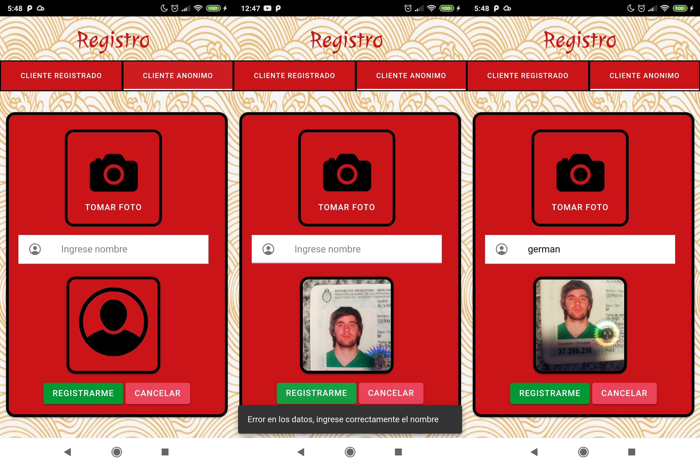
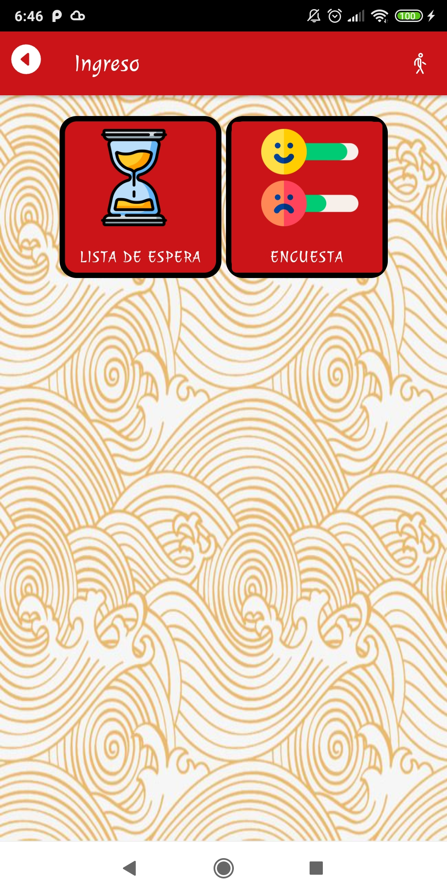

```
Práctica Profesional Supervisada 2021 2do Cuatrimestre
```

# Trabajo práctico n°2 PPS: :custard: La Comanda :tropical_drink:   

GRUPO:  :poultry_leg: REDRAGON  :beer:


 	

Desarrolladores

```
α Germán Alvaredo
β Camila Rori
```

### :information_source: Sprint 1 - Fecha Sabado 23/10/21 al Sabado 30/10/21

``` 
Rori, Camila
```

- HEADER
- 1 JUEGO
- SERVICIO CONSULTA DE MESA


```
Alvaredo, Germán  
  ```

- [x] Login
- [x] Validación de campos de login
- [x] Dar de alta un cliente registrado
- [x] Validación de campos y formatos de registro del cliente
- [x] Supervisor acepta y rechaza cliente (sin enviar el mail)
- [x] Registrar un cliente anonimo


### Login y validaciones


### Cliente Registrado y anónimo


### :information_source: Sprint 2 - Fecha Sabado 30/10/21 al Sabado 06/11/21


``` 
Rori , Camila
 ```

- [x] Gestion : Realizar Pedidos 
- [x] Icono 
- [x] Splash 
- [x] Sonido de inicio
- [x] Juego PPT (piedra , papel o tijera ) 20% descuento 


### Realizar Pedido


###  Icono 


### Splash


###  Juego PPT (piedra , papel o tijera)


```
 Alvaredo , Germán 
 ```

- [x] Gestion: Ingreso al Local con usuario Registrado y ponerse en lista de Espera
- [x] Correción de registro anonimo de botones que estaban juntos (video 1)
- [x] Gestion: Solicitar Mesa (video 3)
- [x] Gestion: Supervisor o dueño acepta y rechaza cliente (con envío el mail) (video 2)


### Cliente Registrado


### Correción de registro anonimo




### Ingreso al local


### Menu con botones de lista de espera y encuesta



### Ponerse en Espera


### Asignacion de mesa con metre


### gif Asignacion


### Envio de Email


### :information_source: Sprint 3 - Fecha Sabado 06/11/21 al Sabado 13/11/21

``` Rori , Camila ```

- [x] Gestion : Confirmar Pedidos
- [x] Cliente consulta estado pedido
- [x] Solicitar Cuenta
- [x] Encuesta del Cliente 

### Gestion : Confirmar Pedidos


### Consultar estado pedido


### Solicitar Cuenta


### Encuesta del Cliente 


``` Alvaredo , Germán ```
- [x]: Gestion Ingreso al local
- [x]: Estado pendiente/rechazado de la cuenta Registrada/Anónima
- [x]: Juegos de 10% de descuento (TATETI)
- [x]: Juegos de bebida gratis (MEMOTEST)


###Ingreso al local


###Estados de la cuenta pendiente / rechazado


### Juego Tateti (10% de descuento)


### Juegos MEMOTEST (bebida gratis)


### :information_source: Sprint 4 - Fecha Sabado 13/10/21 al Sabado 20/11/21

``` Alvaredo , Germán ```

- [x]: Push Notification
- [x]: Consulta al mozo
- [x]: Pagina Home
- [x]: Pagina Lista de Espera
- [x]: Pagina Lista de Pendientes
- [x]: Pagina Menu
- [x]: cambios y correción de asignacion de mesa

### Menu de Metre y su notificación de ingreso al local


### Menu de mozo y su notificación de chat


### Menu de supervisor/dueño y su notificación de pendientes


### Menu de cocinero/bartender y su notificación de mozo a empleados (falta imagen)


### Menu de mozo y su notificación de empleados al mozo (falta imagen)


### Home del Cliente Registrado/Anonimo 


### Cliente anonimo en lista de espera


### Correción en asignacion de mesa


### Cliente con mesa asignada 


### Supervisor en listado pendientes


### Menu del Cliente


### Chat con el Mozo


``` Rori , Camila ```

- [x]: Historial de Encuestas


### Cliente en histórial de Encuestas


