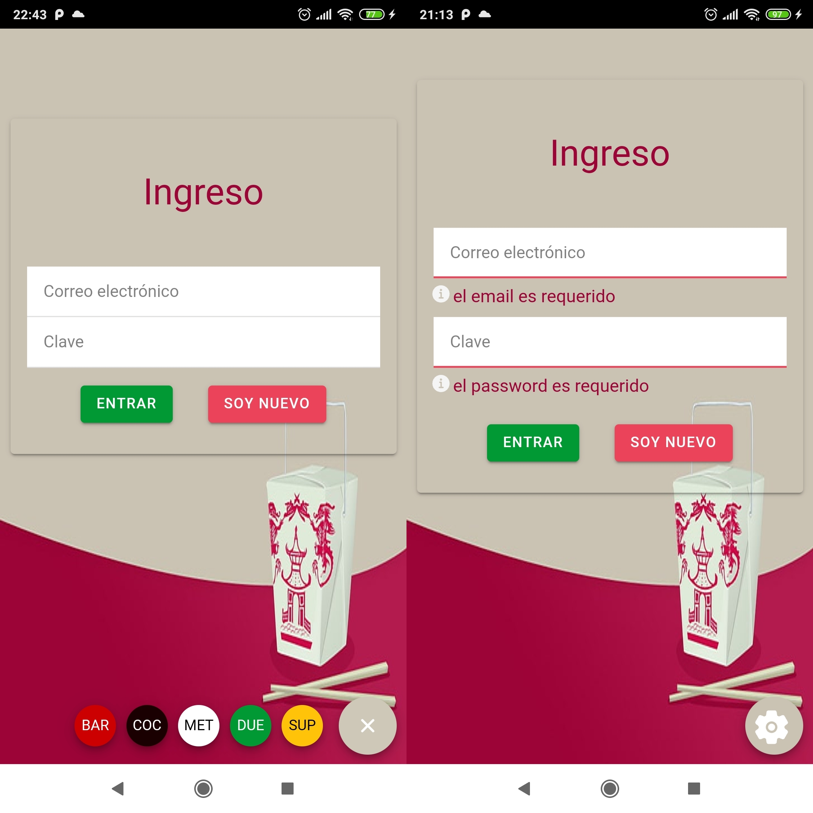
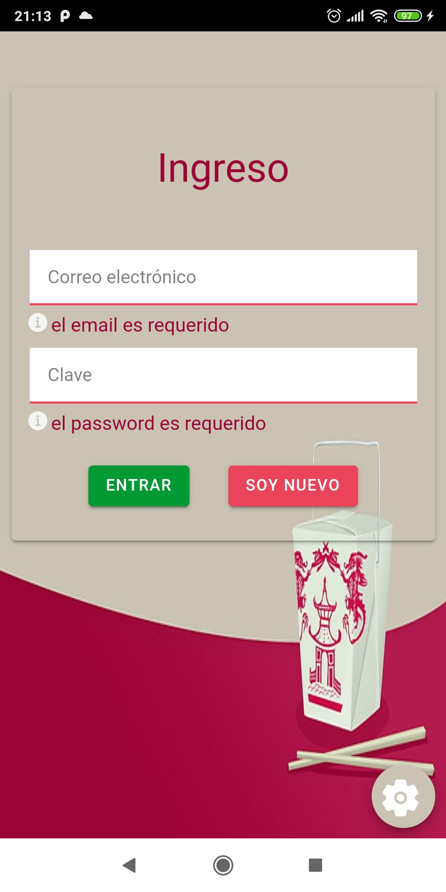
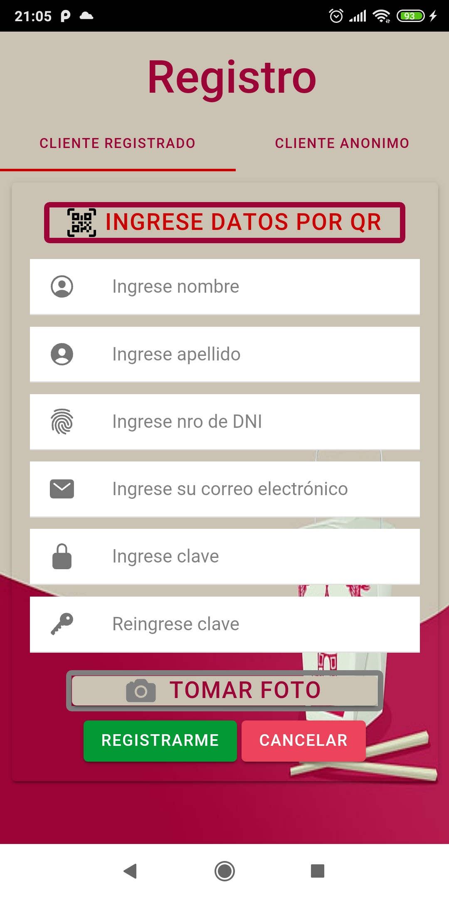
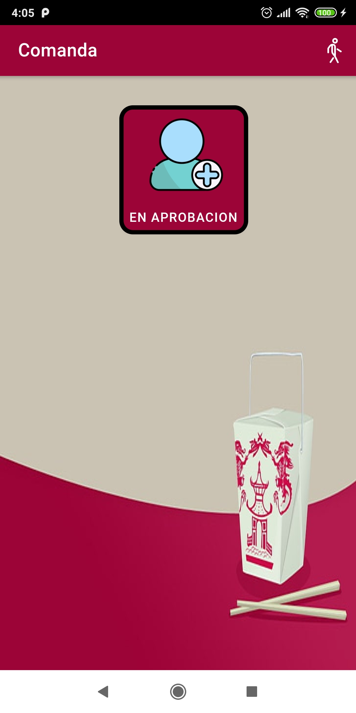

# 2021_TP_PPS_Comanda_2_cuatri
:custard: La Comanda :tropical_drink:

GRUPO:  :poultry_leg: REDRAGON  :beer:


 	Práctica Profesional Supervisada 2021 2do Cuatrimestre  

Desarrolladores

```
α Germán Alvaredo
β Camila Rori
```

### 1 - Fecha Sabado 23/10/21 al Sabado 30/10/21

``` 
Rori, Camila
```

- HEADER
- 1 JUEGO
- SERVICIO CONSULTA DE MESA


```
Alvaredo, Germán  
  ```

- [x] Login
- [x] Validacion de campos de login
- [x] Dar de alta un cliente registrado
- [x] Validacion de campos y formatos de registro del cliente
- [x] Supervisor acepta y rechaza cliente (sin enviar el mail)
- [x] Registrar un cliente anonimo









### 2 - Fecha Sabado 30/10/21 al Sabado 06/11/21

``` Rori , Camila ```

- Gestion : Realizar Pedidos
- Gestion : Confirmar Pedidos
- Encuesta del Cliente
- Splash

``` Alvaredo , Germán ```

- Gestion: Ingreso al Local
- Gestion: Solicitar Mesa
- Gestion: Supervisor o dueño acepta y rechaza cliente (con envio el mail)
- 2 Juegos
- Pagina Home


