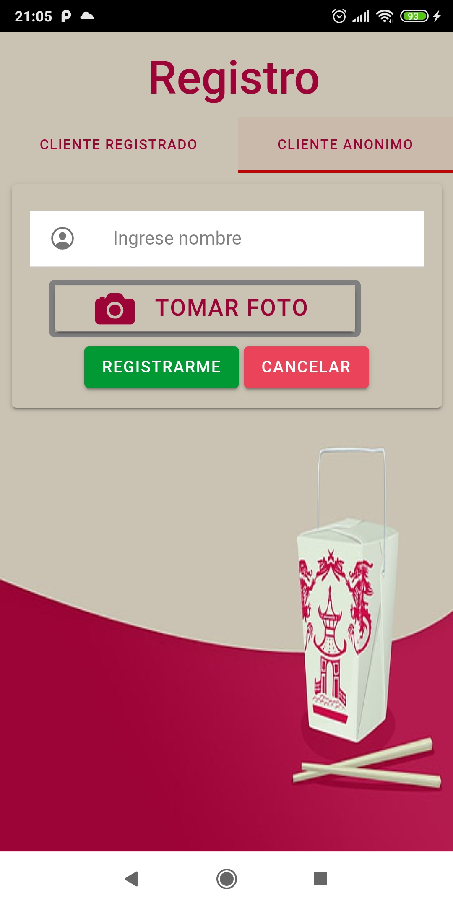

# 2021_TP_PPS_Comanda_2_cuatri
:custard: La Comanda :tropical_drink:

GRUPO:  :poultry_leg: REDRAGON  :beer:


 	Práctica Profesional Supervisada 2021 2do Cuatrimestre  

Desarrolladores

```
α Germán Alvaredo
β Camila Rori
```

### 1 - Fecha Sabado 23/10/21 al Sabado 30/10/21

``` 
Rori, Camila
```

- HEADER
- 1 JUEGO
- SERVICIO CONSULTA DE MESA


```
Alvaredo, Germán  
  ```

- [x] Login
- [x] Validación de campos de login
- [x] Dar de alta un cliente registrado
- [x] Validación de campos y formatos de registro del cliente
- [x] Supervisor acepta y rechaza cliente (sin enviar el mail)
- [x] Registrar un cliente anonimo


### Login y validaciones


### Cliente Registrado y anónimo




### ------- 


### 2 - Fecha Sabado 30/10/21 al Sabado 06/11/21

``` Rori , Camila ```

- [x] Gestion : Realizar Pedidos (video 2)
- [x] Icono (video 1)
- [x] Splash (video 1)
- [x] Sonido de inicio (video 1)
- [x] Juego PPT (piedra , papel o tijera ) 20% descuento (video 3)


### Realizar Pedido


###  Icono y Splash


###  Juego PPT (piedra , papel o tijera)


``` Alvaredo , Germán ```
- [x] Gestion: Ingreso al Local con usuario Registrado y ponerse en lista de Espera
- [x] Correción de registro anonimo de botones que estaban juntos (video 1)
- [x] Gestion: Solicitar Mesa (video 3)
- [x] Gestion: Supervisor o dueño acepta y rechaza cliente (con envío el mail) (video 2)

### Correción de registro anonimo


### Ingreso al local


### Menu con botones de lista de espera y encuesta


### Ponerse en Espera


### Asignacion de mesa con metre


### Envio de Email


### 3 - Fecha Sabado 06/11/21 al Sabado 13/11/21

``` Rori , Camila ```
- [x] Gestion : Confirmar Pedidos
- [x] Cliente consulta estado pedido
- [x] Solicitar Cuenta
- [x] Encuesta del Cliente 

### Gestion : Confirmar Pedidos


### Consultar estado pedido


### Solicitar Cuenta


### Encuesta del Cliente 


``` Alvaredo , Germán ```
-  Gestion: Ingreso al Local completo
- Push notification 
- Consulta al mozo
- 2 Juegos
- Pagina Home completo


